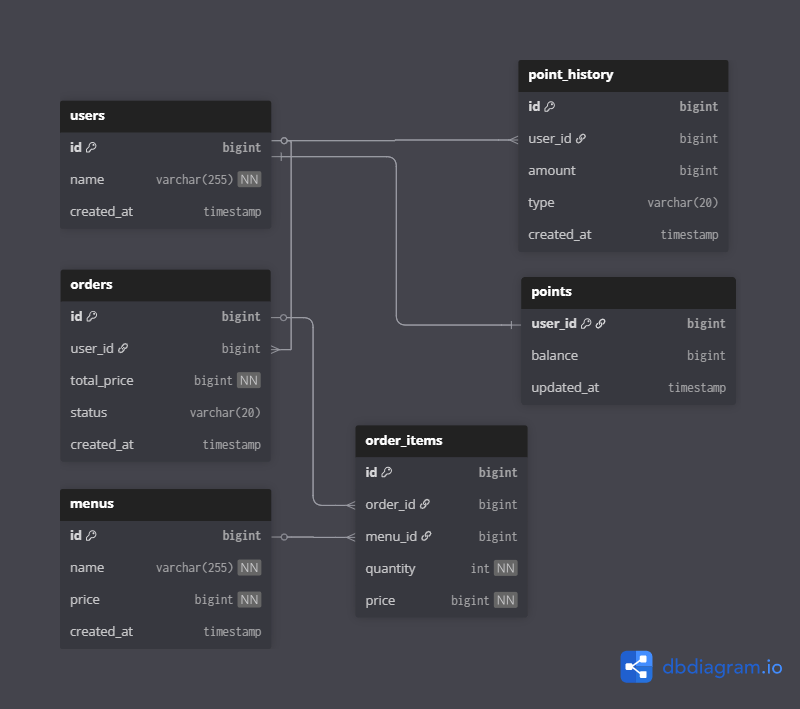

# ☕ Coffee Order Project

커피 메뉴 조회, 포인트 충전, 주문 및 결제 시스템을 위한 RESTful API 서버입니다.  
다중 서버 인스턴스 환경에서의 **동시성 제어**와 **데이터 정합성** 보장을 최우선으로 설계되었습니다.

---

## 1. 설계 내용

### 📊 ERD (Entity Relationship Diagram)
*   **User/Point 분리:** 포인트 수정 시 사용자 정보 잠금을 최소화하기 위한 분리 설계.
*   **Point History:** 모든 포인트 변동 내역을 기록하여 데이터 추적성 확보.

<p align="center">
  
</p>

### 📑 API 명세서
| 기능 | Method | Endpoint | 설명 |
| :--- | :--- | :--- | :--- |
| 메뉴 조회 | `GET` | `/api/menus` | 전체 커피 메뉴 목록 조회 |
| 포인트 충전 | `PATCH` | `/api/points/charge` | 사용자 포인트 충전 |
| 주문/결제 | `POST` | `/api/orders` | 커피 주문 및 포인트 결제 |
| 인기 메뉴 | `GET` | `/api/menus/popular` | 최근 7일간 인기 메뉴 TOP 3 조회 |

---

### 1. 커피 메뉴 목록 조회 API
전체 메뉴의 정보를 조회합니다.

*   **Endpoint:** `GET /api/menus`
*   **Success Response (200 OK)**
    ```json
    [
      {
        "menuId": 1,
        "name": "아메리카노",
        "price": 4500
      },
      {
        "menuId": 2,
        "name": "카페라떼",
        "price": 5000
      }
    ]
    ```

---

### 2. 포인트 충전하기 API
사용자의 포인트를 충전합니다.

*   **Endpoint:** `PATCH /api/points/charge`
*   **Request Body**
    ```json
    {
      "userId": 1,
      "amount": 10000
    }
    ```
*   **Success Response (200 OK)**
    ```json
    {
      "userId": 1,
      "currentBalance": 15000
    }
    ```
*   **Error Cases**
    *   `400 BAD_REQUEST`: 충전 금액이 0원 이하인 경우 (`INVALID_AMOUNT`)
    *   `404 NOT_FOUND`: 존재하지 않는 사용자인 경우 (`USER_NOT_FOUND`)

---

### 3. 커피 주문 및 결제 API
사용자의 포인트를 차감하여 주문을 완료하고, 외부 데이터 플랫폼으로 전송합니다.

*   **Endpoint:** `POST /api/orders`
*   **Request Body**
    ```json
    {
      "userId": 1,
      "menuId": 1
    }
    ```
*   **Success Response (201 Created)**
    ```json
    {
      "orderId": 500,
      "userId": 1,
      "menuId": 1,
      "totalPrice": 4500,
      "orderedAt": "2026-05-03T20:50:00"
    }
    ```
*   **Error Cases**
    *   `400 BAD_REQUEST`: 잔액이 부족한 경우 (`INSUFFICIENT_BALANCE`)
    *   `404 NOT_FOUND`: 메뉴가 존재하지 않거나 사용자가 없는 경우 (`MENU_NOT_FOUND`, `USER_NOT_FOUND`)
    *   `409 CONFLICT`: 동시 요청으로 인해 결제 처리가 실패한 경우 (`CONCURRENCY_ERROR`)

---

### 4. 인기 메뉴 목록 조회 API
최근 7일간 주문 횟수가 가장 많은 상위 3개 메뉴를 조회합니다.

*   **Endpoint:** `GET /api/menus/popular`
*   **Success Response (200 OK)**
    
```json
    [
      {
        "menuId": 1,
        "name": "아메리카노",
        "orderCount": 150
      },
      {
        "menuId": 3,
        "name": "돌체라떼",
        "orderCount": 120
      },
      {
        "menuId": 2,
        "name": "카페라떼",
        "orderCount": 95
      }
    ]
```

---

### ⚠️ 예외 코드 정의 (Error Codes)

| Error Code | Status | Description |
| :--- | :--- | :--- |
| `USER_NOT_FOUND` | 404 | 요청한 사용자를 찾을 수 없음 |
| `MENU_NOT_FOUND` | 404 | 요청한 메뉴를 찾을 수 없음 |
| `INVALID_AMOUNT` | 400 | 충전 금액이 올바르지 않음 |
| `INSUFFICIENT_BALANCE` | 400 | 결제 시 포인트 잔액이 부족함 |
| `CONCURRENCY_ERROR` | 409 | 분산 락 획득 실패 등 동시성 문제 발생 |
| `INTERNAL_SERVER_ERROR`| 500 | 서버 내부 로직 오류 |

---

## 2. 설계의 의도

*   **관심사의 분리 (Separation of Concerns):** 주문(Order), 결제(Point), 통계(Popular Menu) 로직을 서비스 레이어에서 명확히 분리하여 유지보수성을 높였습니다.
*   **확장성 (Scalability):** 다중 인스턴스 환경을 고려하여 서버 로컬 자원(Memory, Lock)에 의존하지 않고 외부 분산 환경(Redis)을 활용하도록 설계했습니다.
*   **비결합도 (Loose Coupling):** 주문 완료 후 데이터 플랫폼으로의 전송 로직을 이벤트 기반 비동기로 처리하여, 외부 시스템의 장애가 주문 서비스에 영향을 주지 않도록 설계했습니다.

---

## 3. 문제 해결 전략 및 분석

### 🚀 동시성 이슈 해결 (Point Charge & Use)
*   **문제 분석:** 여러 대의 서버에서 동일 사용자가 동시에 결제/충전을 시도할 때, Race Condition으로 인해 포인트가 부정확하게 계산될 위험이 있음.
*   **해결 전략:** **Redis 분산 락(Redisson)** 채택.
    *   `userId`를 식별자로 사용하여 특정 사용자에 대한 포인트 작업의 원자성(Atomicity) 보장.
    *   DB의 비관적 락보다 유연한 타임아웃 처리가 가능하여 데드락(Deadlock) 위험 감소.

### 📈 인기 메뉴 집계 성능 최적화
*   **문제 분석:** 매번 주문 내역 테이블을 전수 조사할 경우, 대량 데이터 환경에서 조회 성능 저하 발생.
*   **해결 전략:** **집계 데이터 캐싱** 또는 **실시간 카운팅**.
    *   Redis의 `Sorted Set`을 활용하여 실시간 주문 시 카운트를 합산하거나, 배치 작업을 통해 집계 테이블을 갱신하는 구조 제안.

---

## 4. 기술적 선택 이유

| 기술 | 선택 이유 |
| :--- | :--- |
| **Spring Boot** | 빠른 생산성과 안정적인 생태계, JPA를 통한 객체 중심의 설계 가능. |
| **Redis (Redisson)** | 다중 인스턴스 환경에서 가장 효율적인 분산 락 구현 및 조회 성능 최적화(Caching) 가능. |
| **Apache Kafka** | 데이터 수집 플랫폼으로의 실시간 전송 시, 데이터 유실을 방지하고 시스템 간 결합도를 최소화하기 위해 채택. |
| **MySQL (InnoDB)** | 트랜잭션 지원(ACID)과 행 단위 잠금(Row-level Lock)을 통한 강력한 데이터 정합성 제공. |

---

## 5. 테스트 케이스 및 검증
*   **동시성 테스트:** `CountDownLatch`를 활용하여 100건 이상의 동시 포인트 차감 요청 시 정합성 유지 확인.
*   **통합 테스트:** 주문 -> 결제 -> 데이터 전송으로 이어지는 전체 시나리오 검증.
*   **예외 처리:** 잔액 부족, 존재하지 않는 메뉴 조회 등 엣지 케이스에 대한 에러 응답 검증.

---